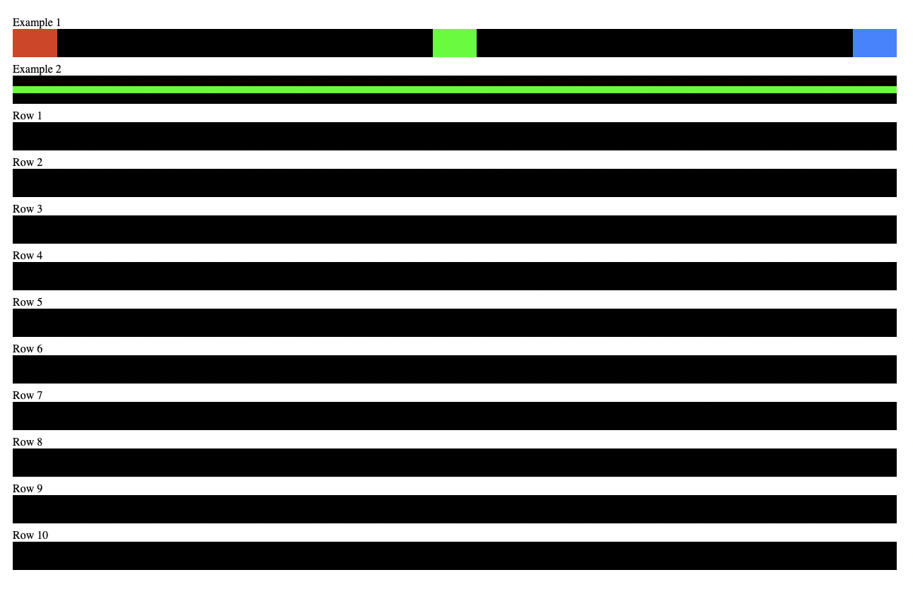
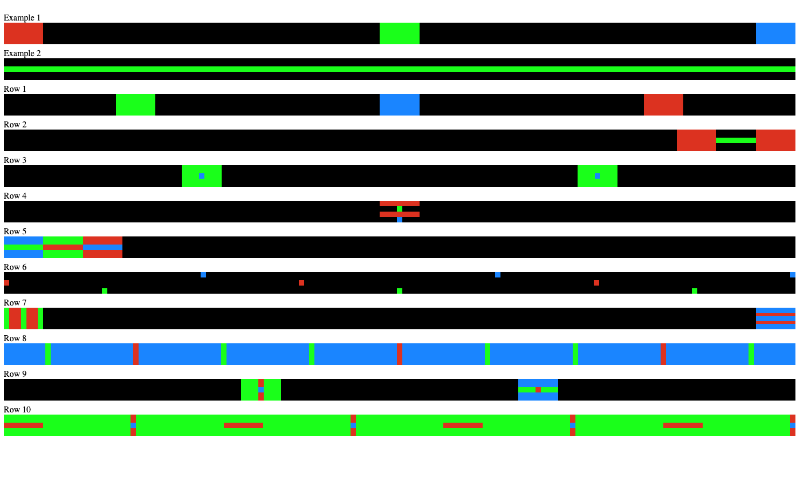

[](https://classroom.github.com/a/BoDH87jl)
## Assignment 1
### Due Date: 09/26/24 - 5:00pm EST

*Assignment deadlines are strictly enforced, please do try to hand in your assignments on time, and I will honor your commitment by grading them and giving feedback in a timely manner. I do understand that sometimes there may be emergencies that we need to attend to. Please do reach out to me as soon as possible if you know you won't be able to make a deadline.*

---

## Assignment Description - Part 1 - 60%

This first part of the assignment is designed to help you get comfortable creating `<div>`'s and styling them using the Flexbox approach for positioning, with some other minor CSS modifications to get your elements rendering in a specific way.


Inside the folder `part1`, you'll find a few files provided for you for this assignment! An `index.html` file and an `index.css` file both set up to render the page that you see below. You can open up the `index.html` file in a browser (ideally Chrome for compatibility/consistency) to see it render, and it should by default render the page you see here below:



Your assignment is to make the page render like so:



You're free to modify both files found in `part1`, but you may not add any additional files or import any CSS/JS libraries of any kind. Just pure HTML/CSS! This assignment is meant to test your understanding of HTML elements and CSS styling, specifically using the Flexbox model, to position elements in various ways across web pages!

To help you get started, `Example 1` and `Example 2` have been done for you in the provided template code, along with hints provided for you in the comments of the files. For the most part you should be able to complete the assignment and create the necessary `<div>`'s and style them accordingly using what we covered in class (Flexbox display, justify-content, align-items), and by fixing the width/height of the elements.

⚠️ Speaking of which, the `<div>`'s should be styled to either the default width of `5%` and height of `40px`, or if it's a thinner variant, it should be styled to `10px` height and width where needed.

Once you've made the `index.html` file render as I requested, don't forget to commit your code to your repository before moving onto `part2` of this assignment! You will be graded on how close you are able to make your page render to the example shown above!


---

## Assignment Description - Part 2 - 40%

For part 2 of the assignment, you'll be writing a single static web page from scratch, based on specifications outlined below. All your files will be committed to the folder provided/labeled `part2`. Just like`part1`, there's an `index.html` and an `index.css` file provided. You will be writing your code in these files. 

You will also be provided some assets that you need to render the image elements required for this part of the assignment. These assets will be in the folder `./part2/img`. Feel free to take a look and use as many/little of the assets provided.

### Figma Spec

https://www.figma.com/design/2R97upqkFdsAffU91cjVPR/CSCI-395.48%2C-FA24---Assignment-1%2C-Part-2-Specs?node-id=0-1&m=dev&t=Mc6OM8tWxZEa3wgI-1

Figma is a popular sketching/wire framing/prototyping tool that is used by designer and UI/UX researchers to plot our a rough sketch of how the website/app should look like, how it should transition from one state to another, and just overall experiment with different layouts to determine which one looks best and would be the most intuitive to the user. For this assignment, I've created a rough sketch on Figma of how this page should look like, you are allowed some creative freedom with this part of the assignment, but do try and code your page to match the specs as best as possible. Below are the grading guidelines for this part of the assignment, please feel free to reach out if you're unsure of certain parts of the specs or have any questions regarding the grading requirements.

### Grade Breakdown

The details of each section are outlined in the figma specs. If something is not defined, or if it was left up to you to implement it in a _reasonable_ way, then it is free to your interpretation.
If you are still unsure of a spec or requirement, please feel free to reach out to me or post on Slack if you feel like your classmates could also benefit from the clarification!

```
35% - Left Panel
	15% - Top section with circles.
	25% - Bottom section with the pokemon image and controls.
	
10% - Central divider bar is positioned properly and sits between the two panels.

35% - Right Panel
	20% - Spacing between each set of square(s).
	20% - Square dimensions and spacing

20% - Color, Dimension and Positioning
	10% - Color hex code matches on what is shown.
	10% - Positioning/padding where applicable.
```

### Submission

Once you've met all the requirements and are satisfied with your work, don't forget to commit your code to the repository for this assignment. You will be graded based upon whatever code that you have committed by the deadline. If you are unsure of what the state of your repository is, you can always visit it on GitHub and view the files and its contents. Whatever that you see on GitHub is what I will be looking at as well, and is what will be graded.