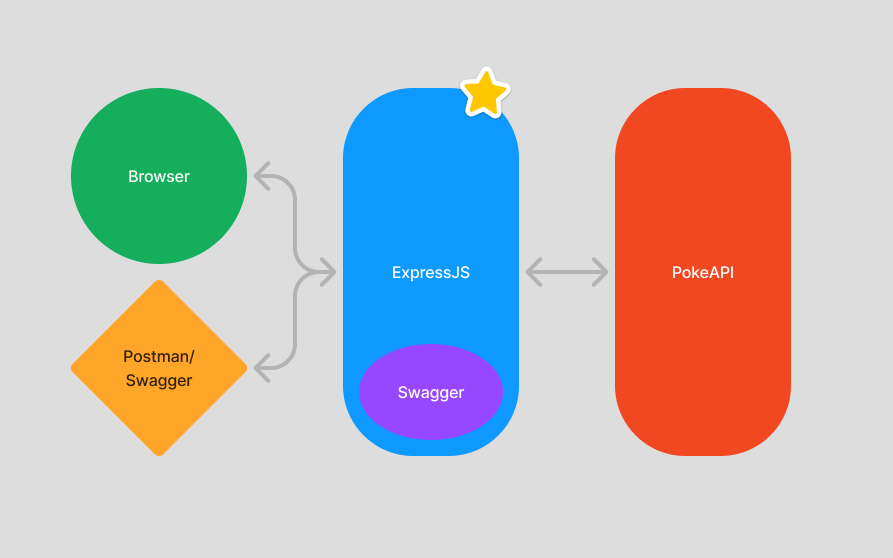

[](https://classroom.github.com/a/MrtJ130o)
## Assignment 3
### Due Date: 11/21/24 - 5:00pm EST

*Assignment deadlines are strictly enforced, please do try to hand in your assignments on time, and I will honor your commitment by grading them and giving feedback in a timely manner. I do understand that sometimes there may be emergencies that we need to attend to. Please do reach out to me as soon as possible if you know you won't be able to make a deadline.*

---

## Assignment Description



For this assignment, you will be working on coding up our ExpressJS app layer (highlighted with a star above) that will serve as the backend for our application. It will be responsible for receiving incoming API requests on various 
endpoints that we will have defined/implemented as part of this assignment, and will also in turn communicate with the PokeAPI to retrieve the necessary Pokémon data needed to process our requests.

There will also be a Swagger UI implemented for you as part of the starter code. Swagger is an API documentation tool that allows users/consumer of our service to view what endpoints and API services are available, and the request/response payload that we can expect 
to work with. See the setup steps below to get your starter code up and running, and how to view our Swagger docs to help guide you with implementing our required endpoints.

---

## Setup & Pre Requisites

First thing that you'd probably want to do is to install the already provided dependencies in assignment code template and see if you can start up and run the server properly.

1) Ensure that you have `NodeJS` version 18+ installed (https://nodejs.org/en/download).
2) In the root of the folder, run `npm i`. This should install all the already provided dependencies that came with the assignment template (listed in package.json). You're free to install NPM packages that you'd like.
3) After they are installed successfully, run `npm run start` to start up the server (by default on port 3000).
4) Browse to `http://localhost:3000` on your browser, and you should see the assignment 3 introduction page.
5) Click on the link to navigate to `http://localhost:3000/api-docs/` to see the various endpoints that you'll need to implement.

Additionally, you might also look to downloading and installing [Postman](https://www.postman.com/), a tool to help you make HTTP requests against an API. This tool should make it easy for you to send requests to any API, without the need to write code.

---

## Instructions

As stated above, you will be implementing the listed endpoints (defined in `swagger.json`) to perform the required functions, more details on each of the endpoint below.
These endpoints will in turn interface with the PokéAPI to fetch the necessary data to help them perform their function/purpose. Follow the instructions for each of the 
endpoints below, and implement all the requirements listed for each.

### Hints
- You'll probably need to know how to interact with the PokéAPI API services/endpoint to get the necessary data that will in turn help us implement _our_ endpoints. Reference their docs here: https://pokeapi.co/docs/v2
- There's a useful resource info API that they provide to help you get a better understanding of what data the various PokéAPI returns, this is useful if you need to say look up an ID or figure out which Pokémon/item IDs belong to what. Have a look at the docs here: https://pokeapi.co/docs/v2#resource-listspagination-section
- Focus on implementing the endpoints one by one, testing frequently. Code/test in increments and always test for regression errors (that is make sure you didn't break anything that was working before when adding new changes).
- Use the generated swagger API page to help you make API requests to the endpoints you'll be implementing: http://localhost:3000/api-docs/ -- You can also use Postman to do the same if you'd like.
- As always, **_PLEASE DO_** be mindful of how much requests you're making against PokéAPI. It is after all a _free_ API services, and you should be mindful to not abuse it, or hit the request limit, as it could impede your progress for this assignment.

### Implementation Details

Follow these implementation guidelines/requirements for each of the endpoints, you will be graded according to these requirements. 
There are also request/response examples given to you
on the generated swagger page at `http://localhost:3000/api-docs/`. Reference these docs for what the request payload should look like
as well as the response payload, as that is the shape of the data/payload that will be used for testing/grading.

#### 1) GET `/pokemon/{id}`
```
- Fetches the relevant Pokémon data given the `{id}` supplied in the request URL param.
- Returns the related data from PokéAPI. Check swagger for the fields/payload example.
- Throws a `400` error if an invalid Pokémon ID or name is given.
```

#### 2) POST `/pokemon/catch`
```
- "Catches" a list of valid Pokémons into our memory/storage.
- Send a list of Pokémon IDs/names as part of the POST request body.
- A caught Pokémon will also have a unique caughtPokemonId generated and attached to its data model.
- If an invalid ID/name is given, do not catch the Pokémon, see swagger for sample response payload.
```

#### 3) GET `/pokemon/{caughtPokemonId}`
```
- Return the Pokémon data of caught Pokémon with the uniquely generated "caughtPokemonId" in the request URL param.
- "caughtPokemonId" is **NOT** the Pokémon ID, but it's a uniquely generated ID by our service 
  - (i.e two identical caught Pokémons have the same id but different caughtPokemonId)
- If invalid caughtPokemonId is given, return an empty object.
```

#### 4) DELETE `/pokemon/{caughtPokemonId}`
```
- Deletes/releases the Pokémon with the given caughtPokemonId. This removes it from our list of caught Pokémons.
- If valid caughtPokemonId is given, return a 200 response and a short message indicating Pokémon was deleted.
- If invalid caughtPokemonId is given, throw a 400 error response.
```

#### 5) POST `/pokemon/teach/{caughtPokemonId}`
```
- Teach moves to your Pokémon with caughtPokemonId.
- Requires an array of 0-4 move ids/names to be passed along as the POST request body.
- A Pokémon may only know 4 moves at any given time. Up to you on which moves to delete to make room for new moves.
- Response payload should have the caughtPokemonId data model with the new "moves" field. See swagger for example.
```

#### 6) PUT `/pokemon/evolve/{caughtPokemonId}`
```
- Evolves your Pokémon with caughtPokemonId.
- Replaces the name & id of the caughtPokemonId with the evolved name & id.
  - (i.e charmander, 4 -> charmeleon, 5)
- If a Pokémon has more than 1 evolution form, up to you to select which form to evolve to.
- If a Pokémon is no longer able to evolve or invalid caughtPokemonId given, return a 400 error.
```

#### 7) POST `/pokemon/breed-check`
```
- Two Pokémon are breedable if they belong to the same egg group.
- For this endpoint, you will accept 2 Pokémon ids/names in the POST request body.
- Look up the necessary data from PokéAPI to determine if these two Pokémon can be bred.
  - *Hint* https://pokeapi.co/docs/v2#egg-groups might be a useful PokéAPI endpoint to use.
- Return True/False as a response.
```

#### 8) GET `/item/buy/{id}`
```
- "Buy" a given item id/name as part of the GET request URL param, and store it in our bag in memory.
- We should store the newly bought item and return the current state of our bag.
- Return 400 error if an invalid item id/name is given.
- Return 500 error if the item is valid but our bag is full. Our bag has a limit of 10 items.
```

#### 9) GET `/bag`
```
- Return the current state of our bag, similar response payload from above when successfully buying an item.
- If no item has been bought yet, the inital state of the bag should be an empty list.
```

#### 10) DELETE `/bag`
```
- Empties out our bag, returns a success message that our bag has been emptied.

