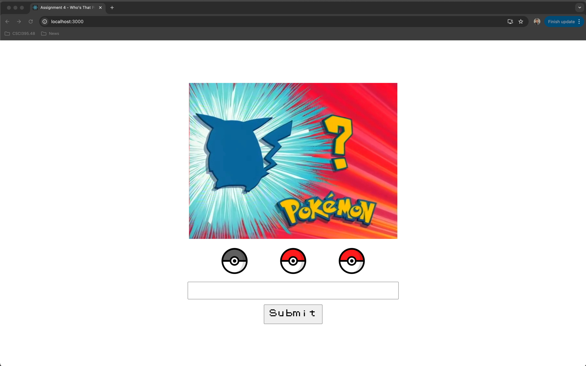
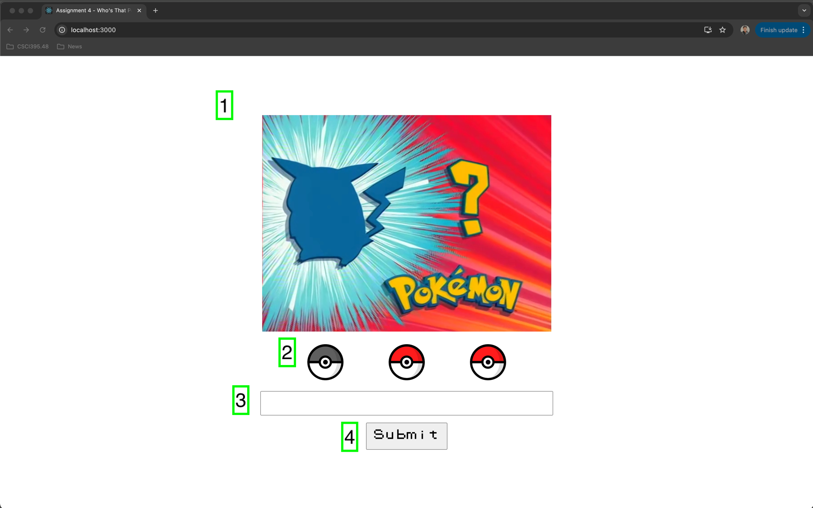

[](https://classroom.github.com/a/HrbmXHfq)
## Assignment 4
### Due Date: 12/17/24 - 5pm EST

*Assignment deadlines are strictly enforced, please do try to hand in your assignments on time, and I will honor your commitment by grading them and giving feedback in a timely manner. I do understand that sometimes there may be emergencies that we need to attend to. Please do reach out to me as soon as possible if you know you won't be able to make a deadline.*

---

## Assignment Description

For this assignment, you'll be using the ReactJS frameworks to build out the frontend portion of your app. You will be implementing a simple "Who's that Pokémon" guessing game, along with a small feature to interface with the PokéAPI to fetch additional details about the Pokémon that we had just guessed.

As with previous assignments, the assets and starter/template code will be provided for you, you simply need to implement the features/requirements outlined below in this `README`.

---

## Setup/Getting Started

- To start up the app, simply navigate to the root of the project folder (where `package.json` is) and run the `npm i` command to install all the dependencies.
- Next run `npm run start` to start up your ReactJS app.
- A browser window should automatically open with the URL directed at `http://localhost:3000`, if not simply open up your browser and navigate to that address.
- You should see the starter code/app being rendered below:



---

## Instructions/Requirements

For this assignment, you will be creating a "Who's That Pokémon" guessing game. The game/app is made up of 4 main parts, each of which template code has already been given to you, and you are simply required to finish implementing each of these 4 parts:



The parts are numbered 1-4 in the image above. See below for requirements around each of these parts.

### 1) Who's that Pokémon Image

- This is the main image that will flip back/forth between the hidden/shadowed image of the Pokémon, and the "guessed" image showing the fully rendered Pokémon.
- Assets for these have been given to you in your `/public/assets` folder, each named with a `_before`/`_after` suffix.
- There are 10 Pokémons that we will be guessing, 20 images in total for these Pokémon (2 per).
- You will start off with the "before" version of the image for each Pokémon, and will only flip over to the "after" version of it if the user has correctly guessed the Pokémon. (See requirement 3 & 4)
- Clicking "Next" (See requirement 4 for submit button/next button) will cause the image to transition to the next Pokémon in the set.

### 2) Correct Guesses

- This section displays 3 Pokéballs, with one already greyed out for you in the starting template.
- These Pokéballs represents the 3 incorrect guesses you have for the game.
- The game should start out with all 3 Pokéballs in their colored state.
- Anytime an incorrect guess is given (See requirement 3 & 4 for guess input), one Pokéball will be greyed out.
- After all 3 is greyed out, the game is over.

### 3) Guess Input

- This is an input where the user will enter the Pokémon's name to guess.
- User can hit enter or click the "Submit" button below to submit their guess.
- When the user had submitted a guess, the input should be cleared out.
- The user is **NOT** allowed to do an empty submission, there should be at least one character needed to submit. Hitting enter or clicking "Submit" without a guess should do nothing.
- Input should be **_CASE INSENSITIVE_**, all Pokémon names provided below, their names can also be seen on their respective `_after` images.

```html
1. Pikachu
2. Onix
3. Clefairy
4. Bulbasaur
5. Charmander
6. Squirtle
7. Gengar
8. Ditto
9. Eevee
10. Snorlax
```

### 4) Submit/Next/New Game Button

- This button will mainly serve as the "Submit" button to submit the guess, but can also be other types of buttons based on the game state.
- See below for each button state requirements

### 4.1) Submit Button

- As long as the game is not over, **AND** the user has not yet guessed a correct Pokémon, this button will render with the text "Submit".
- Clicking on this button will submit the current guess in the input field above (empty submissions will do nothing).

### 4.2) Next Button

- If a Pokémon has been successfully guessed, this button will turn into a "Next" button.
- This button should be rendered with the word "Next" on it. Clicking on it will move onto the next Pokémon in the game to guess, rendering the `_before` image.

### 4.3) New Game Button

- If the game is over, either ran out of guesses, or the user has guessed the last Pokémon, this button will be used to start a new game.
- This button should be rendered with the text "New Game".
- Clicking on this button will reset the game, bringing our user back to the first Pokémon to guess, it will also reset the available guesses Pokéballs to 3.

---